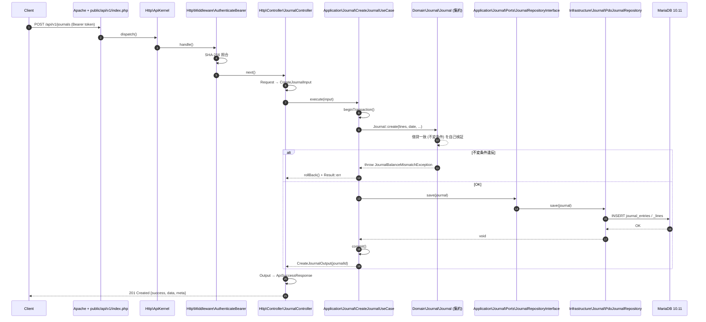

# ADR-005: Layered Architecture

- ステータス: 提案中 (2026-04-21)
- 決定者: (ユーザ承認待ち)
- 関連: [PLAN.md §Phase 4](../PLAN.md), [ADR-001](ADR-001-directory-layout.md), ADR-006 (Ports & Adapters, 未作成), ADR-007 (Strangler Fig 移行計画, 未作成)

---

## 1. 文脈 (Context)

Phase 1〜3 で `src/` 配下に **Domain / Application / Infrastructure / Http / Support** の 5 層スケルトンが立ち上がった（[ADR-001 §2.1](ADR-001-directory-layout.md)、[INTERNAL_ARCHITECTURE.md §4.1](../INTERNAL_ARCHITECTURE.md)）。現時点の実装量は以下の通りで、各層には既に複数の実クラスが存在する:

| 層 | サブディレクトリ | 主要クラス（抜粋） |
|----|----------------|------------------|
| `Domain/` | AccountTitle, Auth, Common, Entity, Exception, Journal, User | `Journal`, `JournalLine`, `AccountTitle`, `DomainException` 階層 |
| `Application/` | AccountTitle, Auth, Entity, Journal | `CreateJournalUseCase`, `SearchJournalUseCase`, `LoginUseCase` |
| `Infrastructure/` | AccountTitle, Auth, Crypto, Database, Entity, Journal, Logging, Migration, Ulid, User | `PdoJournalRepository`, `AesGcmCipher`, `ConnectionFactory`, `MonologLoggerFactory` |
| `Http/` | Controller, Middleware, Response, Kernel, ApiKernel | `JournalController`, `AuthController`, `AuthenticateBearer` middleware |
| `Support/` | Clock, Container, Decimal, Result, Validation | `SystemClock`, `Decimal`, `Result`, `ContainerBootstrap` |

Phase 3 の時点では **181 Unit テスト / PHPStan level 6 green** だが、層間の依存ルールは **暗黙の了解** に留まっている。Phase 4 以降、以下の大規模なドメイン実装を控えており、このままでは層の境界が徐々に漏出する危険がある:

- **Journal 集約の本格拡張**（借貸一致不変条件、明細・税区分・反対仕訳、再計算 UseCase）
- **TrialBalance**（読取モデル、月次スナップショットキャッシュ、パフォーマンス要件 10 万仕訳 < 2 秒）
- **FinancialStatement**（貸借対照表・損益計算書・キャッシュフロー計算書の 3 種、旧 `FinancialStatement*.php` からのロジック移植）
- **Ledger**（総勘定元帳、補助元帳）
- **FixedAssets**（減価償却、除却）

これらを実装する前に、**各層の責務・依存方向・横断関心の扱い** を ADR として確定させ、PR レビューと静的解析で機械的に強制できる状態にする必要がある。

---

## 2. 決定サマリ (Decision)

1. **5 層構成を採用**: `Domain`, `Application`, `Infrastructure`, `Http`, `Support`。ADR-001 §3 のディレクトリ構成を維持。
2. **依存方向は常に内向き（Inward）**:
   - `Domain` ← `Application` ← `Http` の順で依存
   - `Infrastructure` は `Domain` で定義された Port（インターフェース）を **実装する**（ヘキサゴナル）
   - `Support` はユーティリティ層で、他層から参照されるが **他層を参照しない**
3. **横断関心の扱い**:
   - ロギング・キャッシュ・リトライ・トランザクションは `Application` と `Infrastructure` にのみ配置し、`Domain` には漏らさない
   - Claude API 呼出、Monolog、PDO、ファイル I/O などの副作用は全て `Infrastructure` に隔離
4. **Port の置き場所**:
   - ドメイン知識で定義できる Port（`JournalRepositoryInterface` など）は `Domain/{BoundedContext}/` に置く
   - ユースケース固有の Port（通知送信、メール配送、AI 抽出など）は `Application/{BoundedContext}/Ports/` に置く
5. **違反の防止**:
   - レビュー時の機械検証ルール（§7）を CI に組み込む
   - Phase 4.2 後半で `deptrac` 相当の依存規約ツール導入を検討

---

## 3. 各層の責務

### 3.1 `Domain/` — ドメイン層

**責務**:
- **集約ルート (Aggregate Root)**: 不変条件を保持するエンティティの親。外部からは Aggregate Root を通じてのみ内部エンティティにアクセス可
- **値オブジェクト (Value Object)**: 等価性が値で決まる不変オブジェクト（`Amount`, `Ulid`, `JournalDate`, `TaxRate`）
- **ドメインサービス**: 複数集約にまたがるビジネスロジック（例: `JournalBalanceValidator`）
- **ドメイン例外**: ビジネスルール違反（`JournalBalanceMismatchException`, `InvariantViolationException`）
- **リポジトリ Interface**: 永続化抽象（`JournalRepositoryInterface`）

**禁止**:
- PDO / HTTP / Monolog / Guzzle / ファイル I/O への直接参照
- Framework / ライブラリ固有の型（例: `Psr\Http\Message\ServerRequestInterface`）への依存
- `Application` / `Infrastructure` / `Http` への依存
- 静的シングルトン / グローバル状態（`Clock::now()` ではなく注入された `ClockInterface` を使う）

**許可**:
- `Support/` のピュアなユーティリティ（`Decimal`, `Result`, VO 基底）への依存
- PHP 標準型・`DateTimeImmutable`・`bcmath`（`Decimal` 経由）

### 3.2 `Application/` — アプリケーション層

**責務**:
- **ユースケース (UseCase)**: 1 操作 = 1 クラス（`CreateJournalUseCase::execute(Input): Output`）
- **入出力 DTO**: `CreateJournalInput`, `CreateJournalOutput`（readonly プロパティ、immutable）
- **トランザクション境界**: `PDO::beginTransaction` / `commit` / `rollBack` はこの層で管理
- **Port 定義**: ユースケース固有の外部依存抽象（`MailerInterface`, `ReceiptExtractorInterface`）
- **Application Service**: 複数 UseCase を横断する軽量オーケストレーション（最小限）

**禁止**:
- HTTP / Request / Response 固有の処理（ヘッダ解釈、ステータスコード判定）
- Controller / Middleware への逆参照
- `Infrastructure` の具象クラスへの `new` 直呼（必ずコンストラクタ注入）

**許可**:
- `Domain` の集約・VO・Port を型注釈として使用
- `Infrastructure` の **Interface のみ** を型注釈として使用（実装は DI コンテナで注入）
- `Support` のユーティリティ

### 3.3 `Infrastructure/` — インフラストラクチャ層

**責務**:
- **リポジトリ実装**: `PdoJournalRepository implements JournalRepositoryInterface`
- **外部 API クライアント**: `ClaudeClient`, `BankCsvImporter`, `SmtpMailer`
- **横断 I/O**: `MonologLoggerFactory`, `AesGcmCipher`, `UlidGenerator`
- **マイグレーション**: `scripts/migrate/` の DDL 適用ランナー
- **永続化モデル ↔ ドメインモデルの変換**: `JournalRow::toAggregate()` のようなマッピング

**禁止**:
- ビジネスルールの分岐（`if ($journal->amount > 1_000_000) { ... }` のような判定は `Domain` か `Application` に）
- `Http` 層の型への依存
- 他の Infrastructure 実装への横断参照（例: `PdoJournalRepository` が `SmtpMailer` を直に `new` しない。必要なら `Application` で合流）

**許可**:
- `Domain` の Port を実装、集約・VO を参照
- `Application` の Port を実装（Mailer など）
- `Support` のユーティリティ

### 3.4 `Http/` — HTTP 層

**責務**:
- **ルーティング**: `FastRoute` による URL → Controller マッピング
- **ミドルウェア**: 認証（`AuthenticateBearer`）、CORS、JSON body パース、エラーハンドリング
- **Controller**: リクエストから UseCase Input を組み立て、UseCase Output を Response に変換
- **Response Envelope**: `{success, data, error, meta}` への整形（`Rucaro\Http\Response\ApiResponse`）
- **Request/Response 変換**: PSR-7 ↔ UseCase DTO

**禁止**:
- ビジネスルールの実装（Controller に 50 行以上のロジックが出現したら UseCase に抜く）
- `Infrastructure` の具象クラスへの **直接参照**（`new PdoJournalRepository(...)` は NG、DI コンテナ経由で Interface を解決）
- Controller から Repository を直呼び（必ず UseCase を介在させる）

**許可**:
- `Application` の UseCase を呼出
- `Domain` の集約・VO を型注釈として参照（Response シリアライズ用）
- `Support` のユーティリティ

### 3.5 `Support/` — 横断ユーティリティ層

**責務**:
- **`Clock`**: `SystemClock` / `FrozenClock`（テスト用）
- **`Decimal`**: bcmath ラッパ、未ロード時は int64 固定小数点フォールバック
- **`Result<T, E>`**: 成功/失敗の直和型代替（例外を使わないフロー）
- **`Container`**: 軽量 DI コンテナ（`ContainerBootstrap`）
- **`Validation`**: 入力検証 VO 基底（型安全な `NonEmptyString`, `PositiveInt` など）

**禁止**:
- 他層（`Domain`/`Application`/`Infrastructure`/`Http`）への依存（`Support` は全てのレイヤの土台なので、循環を起こさない）
- ビジネスルール（あくまで汎用ユーティリティ）

**許可**:
- PHP 標準型のみに依存
- 外部ライブラリ（`ramsey/uuid` など）は最小限

---

## 4. 依存ルール（マトリクス）

矢印は「参照可否」。`✓` = 参照可、`✗` = 参照禁止、`△` = 条件付き。

| From \ To       | Domain | Application | Infrastructure | Http | Support |
|-----------------|:------:|:-----------:|:--------------:|:----:|:-------:|
| **Domain**      | —      | ✗           | ✗              | ✗    | ✓       |
| **Application** | ✓      | —           | △ (Interface のみ型注釈で可) | ✗ | ✓ |
| **Infrastructure** | ✓   | △ (UseCase 側 Port を実装する場合のみ) | — | ✗ | ✓ |
| **Http**        | △ (VO/集約を Response シリアライズ用に参照可) | ✓ | ✗ (DI コンテナ経由で Interface のみ) | — | ✓ |
| **Support**     | ✗      | ✗           | ✗              | ✗    | —       |

### 補足

- `Application → Infrastructure (△)`: 型注釈として `MailerInterface` を書くのは OK、`new SmtpMailer()` は NG。
- `Http → Domain (△)`: `Journal` 集約をそのままレスポンスに詰めるのは避け、`JournalResource` のような DTO に詰め替えるのが望ましい（ただし集約を型注釈として参照することは許可）。
- `Http → Infrastructure (✗)`: Controller から Repository を直接呼ばない。必ず UseCase 経由。
- `Support → *`: 完全独立。循環を作らないために、`Support` から他層への参照は一切禁止。

---

## 5. 命名規則

### 5.1 `Domain/`

| 要素 | 規則 | 例 |
|------|------|-----|
| 集約ルート | `{BoundedContext}` | `Journal`, `AccountTitle`, `Entity` |
| 内部エンティティ | `{BoundedContext}{Entity}` | `JournalLine`, `FiscalTermPeriod` |
| 値オブジェクト | 名詞単数 | `Amount`, `JournalDate`, `TaxRate`, `Ulid` |
| ドメインサービス | `{Action}{Target}Service` または `{Target}Validator` | `JournalBalanceValidator` |
| リポジトリ Interface | `{BoundedContext}RepositoryInterface` | `JournalRepositoryInterface` |
| ドメイン例外 | `{Condition}Exception`（`DomainException` 派下） | `JournalBalanceMismatchException` |

### 5.2 `Application/`

| 要素 | 規則 | 例 |
|------|------|-----|
| UseCase | `{Action}{BoundedContext}UseCase` | `CreateJournalUseCase`, `RecalcBalancesUseCase` |
| Input DTO | `{Action}{BoundedContext}Input` | `CreateJournalInput` |
| Output DTO | `{Action}{BoundedContext}Output` | `CreateJournalOutput` |
| Port | `{Capability}Interface` または末尾 `Port` | `MailerInterface`, `ReceiptExtractorPort` |

### 5.3 `Infrastructure/`

| 要素 | 規則 | 例 |
|------|------|-----|
| Repository 実装 | `Pdo{BoundedContext}Repository`（adapter 接頭辞で技術明示） | `PdoJournalRepository`, `PdoAccountTitleRepository` |
| 外部 API クライアント | `{Vendor}{Service}Client` | `ClaudeApiClient`, `GuzzleSlackClient` |
| ロガー / キャッシュ等 | `{Backend}{Abstract}` | `MonologLoggerFactory`, `RedisTokenCache` |
| マイグレーション | 番号プレフィックス | `0001_init.sql`, `M0001InitMigration.php` |

### 5.4 `Http/`

| 要素 | 規則 | 例 |
|------|------|-----|
| Controller | `{BoundedContext}{Action}Controller` または `{BoundedContext}Controller` | `JournalController`, `AuthLoginController` |
| Middleware | `{Name}Middleware` | `AuthenticateBearerMiddleware`, `JsonBodyParserMiddleware` |
| Response | `Api{Kind}Response` | `ApiSuccessResponse`, `ApiErrorResponse` |

### 5.5 `Support/`

| 要素 | 規則 | 例 |
|------|------|-----|
| ユーティリティ | 名詞単数 | `Clock`, `Decimal`, `Result` |
| 実装バリアント | `{Variant}{Abstract}` | `SystemClock`, `FrozenClock` |

---

## 6. データフロー例

### 6.1 `POST /api/v1/journals` のシーケンス



### 6.2 依存注入の流れ（`ContainerBootstrap`）

```
ContainerBootstrap
  ├─ bind(PDO::class, fn() => ConnectionFactory::create($config))
  ├─ bind(JournalRepositoryInterface::class,
  │        fn($c) => new PdoJournalRepository($c->get(PDO::class), $c->get(UlidGenerator::class)))
  ├─ bind(CreateJournalUseCase::class,
  │        fn($c) => new CreateJournalUseCase(
  │            $c->get(JournalRepositoryInterface::class),
  │            $c->get(ClockInterface::class),
  │            $c->get(PDO::class)   // トランザクション用
  │        ))
  └─ bind(JournalController::class,
           fn($c) => new JournalController($c->get(CreateJournalUseCase::class), ...))
```

Controller → UseCase → RepositoryInterface → PdoRepository の連鎖は **DI コンテナが解決** し、Controller から `new PdoJournalRepository(...)` を書くことは絶対にない。

---

## 7. 違反検出

### 7.1 PHPStan + ルールセット

`phpstan.neon` で以下を Phase 4.1 開始時点で有効化:

```yaml
parameters:
  level: 6
  paths:
    - src
  excludePaths:
    - back
  # ドメイン層で Infrastructure の具象クラスを参照した場合にエラー
  ignoreErrors: []
```

### 7.2 CI による文字列ベースの依存規約チェック（暫定）

`deptrac` 本格導入までの暫定策として、CI の lint ステップで以下を実行:

```bash
# Domain 層が Infrastructure / Application / Http を参照したら fail
! grep -rE '^use Rucaro\\(Infrastructure|Application|Http)\\' src/Domain/

# Application 層が Http を参照したら fail
! grep -rE '^use Rucaro\\Http\\' src/Application/

# Application 層が Infrastructure の具象（Interface 以外）を参照したら警告
# （手動レビューで確認する、自動化は deptrac 導入時）

# Support 層が他層を参照したら fail
! grep -rE '^use Rucaro\\(Domain|Application|Infrastructure|Http)\\' src/Support/
```

CI ジョブの例（`.github/workflows/ci.yml` に追加）:

```yaml
- name: Check layer dependency rules
  run: |
    set -e
    if grep -rE '^use Rucaro\\(Infrastructure|Application|Http)\\' src/Domain/ ; then
      echo "::error::Domain layer must not depend on Infrastructure/Application/Http"
      exit 1
    fi
    if grep -rE '^use Rucaro\\Http\\' src/Application/ ; then
      echo "::error::Application layer must not depend on Http"
      exit 1
    fi
    if grep -rE '^use Rucaro\\(Domain|Application|Infrastructure|Http)\\' src/Support/ ; then
      echo "::error::Support layer must not depend on other layers"
      exit 1
    fi
```

### 7.3 `deptrac` 本格導入（Phase 4.2 後半の TODO）

`qossmic/deptrac-shim` を `require-dev` に追加し、`deptrac.yaml` で以下を宣言:

```yaml
deptrac:
  paths:
    - ./src
  layers:
    - name: Domain
      collectors:
        - { type: directory, regex: src/Domain/.* }
    - name: Application
      collectors:
        - { type: directory, regex: src/Application/.* }
    - name: Infrastructure
      collectors:
        - { type: directory, regex: src/Infrastructure/.* }
    - name: Http
      collectors:
        - { type: directory, regex: src/Http/.* }
    - name: Support
      collectors:
        - { type: directory, regex: src/Support/.* }
  ruleset:
    Domain: [Support]
    Application: [Domain, Support]
    Infrastructure: [Domain, Application, Support]
    Http: [Application, Domain, Support]
    Support: []
```

### 7.4 PR レビュー規約

- `src/Domain/**` に変更がある PR では、`use Rucaro\(Infrastructure|Application|Http)` を含まないことをレビュー時に目視確認
- Controller のメソッドが 50 行を超えたら UseCase への抽出を要求（`common/coding-style.md` の 50 行上限に準拠）

---

## 8. トランザクション境界

### 8.1 原則

- **トランザクションは `Application` 層の UseCase で開く・閉じる**
- `Domain` 層はトランザクションを知らない（DB の存在すら知らない）
- `Http` 層もトランザクションを知らない（UseCase の Output を Response に変換するだけ）
- `Infrastructure` 層のリポジトリは **トランザクション内で呼ばれる前提** で実装（自分で `begin`/`commit` しない）

### 8.2 実装パターン

```php
<?php
// src/Application/Journal/CreateJournalUseCase.php
namespace Rucaro\Application\Journal;

use PDO;
use Rucaro\Domain\Journal\Journal;
use Rucaro\Domain\Journal\JournalRepositoryInterface;
use Rucaro\Support\Clock\ClockInterface;

final class CreateJournalUseCase
{
    public function __construct(
        private readonly JournalRepositoryInterface $repository,
        private readonly ClockInterface $clock,
        private readonly PDO $pdo,   // トランザクション制御のため注入
    ) {}

    public function execute(CreateJournalInput $input): CreateJournalOutput
    {
        $this->pdo->beginTransaction();
        try {
            // ドメインオブジェクト生成（不変条件は集約内で自己検証）
            $journal = Journal::create(
                $input->toLines(),
                $input->journalDate,
                $this->clock->now(),
            );

            // 永続化
            $this->repository->save($journal);

            $this->pdo->commit();

            return new CreateJournalOutput(
                journalId: $journal->id()->toString(),
                createdAt: $this->clock->now(),
            );
        } catch (\Throwable $e) {
            $this->pdo->rollBack();
            throw $e;   // Domain 例外は Http 層の ErrorHandler が 4xx に変換
        }
    }
}
```

### 8.3 反例（禁止パターン）

```php
// ✗ NG: Controller でトランザクションを開いている
final class JournalController
{
    public function create(ServerRequest $req): Response
    {
        $this->pdo->beginTransaction();   // Http 層に漏れている
        $this->useCase->execute(...);
        $this->pdo->commit();
    }
}

// ✗ NG: Repository が自分でトランザクションを開いている
final class PdoJournalRepository
{
    public function save(Journal $journal): void
    {
        $this->pdo->beginTransaction();   // 複数 Repository を 1 UseCase 内で呼ぶと壊れる
        $this->pdo->prepare(...)->execute(...);
        $this->pdo->commit();
    }
}

// ✗ NG: Domain 集約が PDO を持っている
final class Journal
{
    public function __construct(private PDO $pdo) {}   // Domain が Infrastructure を知っている
}
```

### 8.4 ネスト防止

- 既にトランザクション内にいる場合の挙動は **savepoint で対応**（MariaDB 対応）
- `Rucaro\Support\Transaction\TransactionRunner` を導入して `run(callable $fn)` で抽象化する案を Phase 4.3 以降で検討

---

## 9. 結果 (Consequences)

### 9.1 Pros

- **テスト容易性**: Domain 層は外部依存ゼロでテスト可能。UseCase は Port を fake に差し替えて 100% 純粋ユニットテスト可。
- **責務の明瞭化**: 新機能追加時に「どの層に何を書くか」で迷わない。
- **型安全**: PHPStan level 6 + readonly DTO で実行時エラーを大幅に削減。
- **Strangler Fig 互換**: 旧 `back/` の `Code_Else_*` クラスと干渉せず、新コードだけで完結。
- **将来のフレームワーク移行に耐える**: `Http` 層を差し替えれば Symfony HttpKernel / ReactPHP / Swoole など任意の実行環境に載る。

### 9.2 Cons / トレードオフ

- **クラス数の増加**: 1 操作 = UseCase + Input + Output + Controller の 4〜5 ファイル。Phase 4 完了時点で `src/` のファイル数は現状の 2〜3 倍になる見込み。
- **冗長感**: 単純な CRUD でもレイヤをまたぐボイラープレートが発生。初期の学習コストあり。
- **マッピング層のコスト**: 集約 ↔ 永続化 Row、UseCase Output ↔ Response の 2 段変換がオーバーヘッドに見える（が、変換点が明示的なのでデバッグは容易）。
- **DI コンテナへの依存**: Controller を手動で組み立てると辛い。`Rucaro\Support\Container` の完成度が Phase 4 のボトルネックになる可能性あり → `ContainerBootstrap` のテストカバレッジを 90% 以上に維持する。

### 9.3 既知の制約

- `deptrac` 未導入のため、Phase 4.1 の間は **grep ベースの暫定チェック** と PR レビューに依存する。機械検証が弱いので、レビュー規律の徹底が必要。

---

## 10. 代替案と却下理由

### 10.1 MVC 単層（Laravel 風）

- **利点**: クラス数少、学習コスト低、Laravel エコシステムが使える
- **却下理由**:
  1. `JournalController` にビジネスロジックを書くと、Phase 4 の不変条件（借貸一致、税計算）が肥大化して 1,000 行超えが確実
  2. Active Record（Eloquent）だと集約内部の不変条件を「保存前に必ず検証」する強制力が弱い
  3. テスト時に DB モックが必要になり、純粋ドメインテストが書けない
  4. ADR-001 §11.1 で既に Laravel 導入は却下済（一貫性維持）

### 10.2 Full Clean Architecture（Entities / UseCase / Interface Adapters / Frameworks & Drivers の 4 層厳格分離）

- **利点**: 最も依存方向が明確、巨大プロダクト向き
- **却下理由**:
  1. 個人運用の会計アプリには過剰（Uncle Bob のサンプル規模でも 20 クラス追加）
  2. `Interface Adapters` 層（Presenter / Gateway）を追加すると、Controller と UseCase の間に中間層が増えて認知負荷が爆発
  3. 現在の 5 層（Domain/Application/Infrastructure/Http/Support）で既に Clean Architecture の核心（依存の逆転）を達成済

### 10.3 Anemic Domain Model（データクラス + サービスクラス）

- **利点**: クラスが薄く、ORM との相性が良い
- **却下理由**:
  1. 「借方合計 = 貸方合計」のような不変条件が複数のサービスに散逸し、新人が壊しやすい
  2. Martin Fowler が 2003 年に明示的に anti-pattern と呼んだ構造
  3. Phase 4 の `Journal` 集約は不変条件保持が最優先なので、Rich Domain Model が必須

### 10.4 Onion Architecture（同心円 4 層）

- **利点**: ヘキサゴナルとほぼ同等、名称が分かりやすい
- **却下理由**:
  1. Layered + Hexagonal（本 ADR の構成）と実質的に同じで、命名が違うだけ
  2. ADR-001 で既に 5 層構成を採用済（一貫性維持）

### 10.5 Modular Monolith（境界付きコンテキスト × 独立モジュール）

- **利点**: Bounded Context ごとに完全独立、マイクロサービス移行容易
- **却下理由**:
  1. Phase 4 時点の BC 数（Journal, TrialBalance, FinancialStatement, Ledger, FixedAssets, Entity, AccountTitle）は 7〜8 個、モジュール化の初期コストが高い
  2. BC 間参照（TrialBalance は Journal を読む）のためのモジュール間 API 設計が複雑化
  3. 将来、どれか 1 BC を独立モジュールに切り出す必要が出たら再検討

---

## 11. 実装チェックリスト（Phase 4.2 Journal 拡張時）

Phase 4.2 で `Journal` 集約を本格拡張する際、以下を全て満たすこと:

- [ ] **[Domain]** `Rucaro\Domain\Journal\Journal` 集約に `use Rucaro\Infrastructure\*` / `use Rucaro\Application\*` / `use Rucaro\Http\*` が 1 つも含まれないこと（grep 確認）
- [ ] **[Domain]** 集約の不変条件（借貸一致、税区分妥当性、日付妥当性）が **コンストラクタ or ファクトリ内** で自己検証されること
- [ ] **[Domain]** `Journal::create()` は `Result<Journal, DomainException>` を返すか、`throw DomainException` で失敗を表現すること（Null 返却禁止）
- [ ] **[Domain]** `Amount` / `JournalDate` / `TaxRate` は **readonly VO**（全プロパティ `readonly`、equals メソッド実装）
- [ ] **[Application]** `CreateJournalUseCase::execute()` が 50 行以内
- [ ] **[Application]** トランザクション（`beginTransaction` / `commit` / `rollBack`）は UseCase 内のみで扱うこと
- [ ] **[Application]** `JournalRepositoryInterface` は `Domain/Journal/` または `Application/Journal/Ports/` に配置（具象クラスを型注釈にしない）
- [ ] **[Application]** Input / Output DTO は **全プロパティ readonly**
- [ ] **[Infrastructure]** `PdoJournalRepository` に `JournalBalanceValidator` 等のドメインロジックが漏れていないこと
- [ ] **[Infrastructure]** `PdoJournalRepository::save()` は自分で `beginTransaction` を呼ばない
- [ ] **[Infrastructure]** 永続化 Row ↔ 集約の変換は `Infrastructure/Journal/Mapper/JournalRowMapper` に隔離
- [ ] **[Http]** `JournalController` に `use Rucaro\Infrastructure\*` が含まれないこと（DI コンテナ経由で Interface のみ解決）
- [ ] **[Http]** Controller メソッド 1 本あたり 50 行以内
- [ ] **[Http]** Response は `ApiSuccessResponse` / `ApiErrorResponse` 経由で `{success, data, error, meta}` エンベロープを強制
- [ ] **[Support]** `Decimal` による金額計算で `float` 型が登場しないこと（bcmath 厳守）
- [ ] **[横断]** CI の「Layer dependency rules」ジョブが green
- [ ] **[横断]** PHPStan level 6 green、新規エラーゼロ
- [ ] **[横断]** `tests/Unit/Domain/Journal/JournalTest.php` で Property-based test（借貸一致は任意の入力に対して保持される）
- [ ] **[横断]** `tests/Unit/Application/Journal/CreateJournalUseCaseTest.php` で `JournalRepositoryInterface` を fake/mock 注入して純粋ユニットテスト
- [ ] **[横断]** `tests/Integration/Infrastructure/Journal/PdoJournalRepositoryIntegrationTest.php` で実 MariaDB 対する round-trip テスト

---

## 12. 付録: レイヤ間の依存方向図

```
       ┌─────────────────────────────────────────────┐
       │                    Http                      │ (Controller, Middleware)
       │  ┌─ calls ──────────────────────────────┐  │
       │  ▼                                       │  │
       │┌──────────────────────────────────────┐ │  │
       ││           Application                 │ │  │ (UseCase, DTO, Port)
       ││  ┌─ uses ────────────────────────┐    │ │  │
       ││  ▼                                │    │ │  │
       ││ ┌──────────────────────────┐      │    │ │  │
       ││ │         Domain            │      │    │ │  │ (Aggregate, VO, Repo IF)
       ││ │   (no outward deps)       │      │    │ │  │
       ││ └──────────────────────────┘      │    │ │  │
       ││       ▲                           │    │ │  │
       ││       │ implements                │    │ │  │
       ││ ┌─────┴─────────────────────┐    │    │ │  │
       ││ │     Infrastructure          │◀──┘    │ │  │ (PDO, Guzzle, Monolog)
       ││ │  (Pdo/Smtp/Claude/Ulid)    │         │ │  │
       ││ └───────────────────────────┘         │ │  │
       │└──────────────────────────────────────┘ │  │
       │                                          │  │
       │  ┌──────────────────────────────────┐  │  │
       │  │            Support                │◀─┘  │  (Clock, Decimal, Result)
       │  │   (no deps on any layer)          │     │
       │  └──────────────────────────────────┘     │
       └─────────────────────────────────────────────┘

依存は常に内向き:
  Http → Application → Domain
  Http → (via DI) → Infrastructure (Interface only)
  Infrastructure → Domain / Application (Port 実装)
  全層 → Support
  Support → (なし)
```

---

## 12.B Phase 6.6 TODO — FinancialStatement 拡張

Phase 6.6 で BS / PL / CS の 3 種 PDF / JSON 出力を導入した (`/api/v1/financial-statements`)。BS と PL は TrialBalance からの category 単位集約で現実的な精度を持つが、**CS (キャッシュフロー計算書) は暫定実装** である。今後のフェーズで以下を拡張する:

- **CS の正式実装** — 間接法で営業CF / 投資CF / 財務CFを分類。現状は営業CFに「当期純利益 + 現預金増減」のみ掲載し、投資・財務CFは空のセクションで雛形化している。
- **BS の流動/固定分離** — `account_titles` に `current` / `noncurrent` 区分列を追加してから、BS の資産・負債をさらに流動/固定に細分化する。現状は `asset/liability/equity` の 3 区分。
- **比較期間表示** — 前期比較を PDF / JSON に載せる場合は GenerateFinancialStatementUseCase に `compareToTermId` を追加。
- **日本語フォント配布** — `storage/fonts/ipaexg.ttf` を CI / 本番の Dockerfile で導入する運用を確立。未設置時は西欧フォントにフォールバックし、PDF 内の日本語がトーフ表示になる (警告ログあり)。

これらは独立した追加フェーズで対応する (ADR-001 で定義する段階移行計画に沿う)。

---

## 13. 参考

- Eric Evans, *Domain-Driven Design* (2003) — 集約・値オブジェクト・リポジトリ
- Alistair Cockburn, *Hexagonal Architecture* (2005) — Ports & Adapters
- Robert C. Martin, *Clean Architecture* (2017) — 依存方向の原則
- Vaughn Vernon, *Implementing Domain-Driven Design* (2013) — 集約設計の実践
- ADR-001 §10 / §付録 A — 本プロジェクトにおけるレイヤ構成の原型
- INTERNAL_ARCHITECTURE.md §4 — Phase 3 完了時点のレイヤ実装状況
