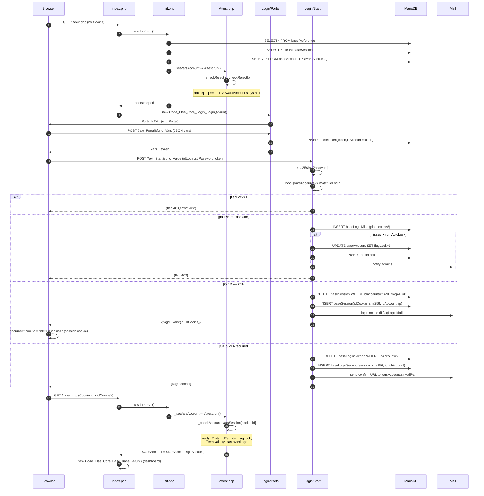
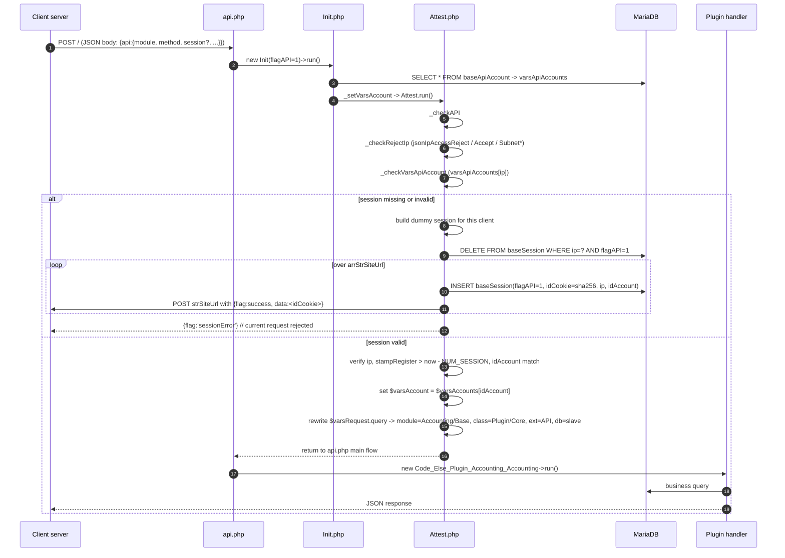

# 旧 Rucaro Accounting 認証フロー解析

> Phase 1.1 調査ドキュメント
> 対象コードベース: `C:\Users\yusuk\StudioProjects\accounting\` (master, `numVersion = 1.50.10`)
> 関連資料: [legacy-routing.md](../phase1/legacy-routing.md), [legacy-schema.md](../phase1/legacy-schema.md)

---

## 1. 概要

Rucaro Accounting の認証は、**ステートフル Cookie セッション**と **IP+サーバ間 Bearer セッション (API)** の 2 系統に分かれ、さらにオプションで **メールリンク方式の 2 段階ログイン**を被せる設計になっている。

| 方式 | 対象 | 識別子 | 保存先 | 入口 |
|---|---|---|---|---|
| Web セッション | ブラウザ | Cookie `id` (sha256 hex 64) | `baseSession` (`flagAPI=0`) | `index.php` |
| API セッション | サーバ間 | リクエスト JSON `api.session` + IP 一致 | `baseSession` (`flagAPI=1`) | `api.php` |
| 2 段階ログイン | ブラウザ | メール到達リンク `session` クエリ | `baseLoginSecond` | `confirm.php?type=login` |
| CSRF-ish トークン | master DB 操作 | `query.token` | `baseToken` | `index.php` / `api.php` |

いずれも PHP の `$_SESSION` は使わず、DB に直接行を書き込む**自前セッションストア**を実装している。セッション有効期限は `numSession = 90000` 秒 (25 時間)、2 段階用は `numSessionLoginSecond = 3600` 秒 (`Init.php` L20-21)。

---

## 2. ログイン (Web) シーケンス

### 2.1 関係ファイル

| ファイル | 役割 |
|---|---|
| `index.php` | エントリポイント。`$varsAccount` 有無でルーティング分岐 |
| `back/class/else/core/base/Init.php` | ブートストラップ (DB / Smarty / Check / Request / Media 等)。`_setVars*()` でグローバル populate |
| `back/class/else/core/base/Attest.php` | セッション Cookie → アカウント復元 (`_checkAccount()`) |
| `back/class/else/core/base/Access.php` | 未認証 IP 通報 (`_checkUnknown()`) + アクセスログ (`_setLog()`) |
| `back/class/else/core/login/Login.php` | 未認証時の front controller。`?ext=Portal/Start/Sign/Forgot/Rebuild` で分岐 |
| `back/class/else/core/login/Portal.php` | ログイン画面 HTML + JSON vars 配信 |
| `back/class/else/core/login/Start.php` | 資格情報検証 + セッション発行 or 2FA 開始 |
| `back/class/else/core/confirm/Login.php` | 2FA 完了 (`confirm.php?type=login&id=<session>`) |

### 2.2 ブラウザ → サーバ



### 2.3 資格情報検証 (`Login/Start.php::_checkValueLogin`)

1. 入力 `strPassword` を `hash('sha256', ...)` で一方向変換 (unsalted)。
2. `$varsAccounts` (全アカウント in-memory) をループし `idLogin` 一致を検索。
3. 一致したレコードの `flagLock` が立っていれば即エラー。
4. `sha256($input) === baseAccount.strPassword` を文字列比較。
5. 一致すれば Term 有効期間と `numPasswordLimit` 日数をチェック (`flagWebmaster` は免除)。
6. 通過後 `_checkLoginType()` で `$varsPreference.flagLoginSecond` / `$varsAccount.flagLoginSecond` を見て `_setValueSecond()` (2FA) か `_setValue()` (即時発行) を選ぶ。

### 2.4 セッション発行 (`_setValue`, `Confirm/Login.php::_setValue`)

```php
$str      = MICROTIMESTAMP . getPassword(numMark=5,numNum=5,numBig=5,numSmall=5);
$idCookie = hash('sha256', $str); // 64 hex
DELETE FROM baseSession WHERE idAccount=? AND flagAPI=0; // 単一セッション運用
INSERT INTO baseSession(stampRegister, ip, idCookie, idAccount) VALUES (?,?,?,?);
```

HTTP レスポンスは JSON `{flag:1, vars:{id:<idCookie>}}`。**Cookie の Set-Cookie は PHP 側では発行せず**、クライアント JS (`Code_Lib_Cookie.setData`, `back/tpl/templates/else/core/base/js/lib/cookie.js`) が `document.cookie = 'id=' + value` を行う。

---

## 3. API 認証シーケンス

### 3.1 入口

`api.php` は `flagRequest='json'` + `flagAPI=1` で `Init` を起動する。

```php
$classInit = new Code_Else_Core_Base_Init(array(
    'pathTop'     => $pathTop,
    'flagRequest' => 'json',
    'flagAPI'     => 1,
));
```

`Init::_setVars` が `FLAG_API` を見て `_setVarsAPI()` を呼び、`baseApiAccount` を `$varsApiAccounts[ip][strSiteUrl]` に load する。その後 `Attest::run()` が `_checkAPI()` 分岐を走る (Attest.php L39-42)。

### 3.2 シーケンス



### 3.3 API 認証の特徴

- **IP アドレスが一次鍵**: `baseApiAccount.ip` と `$varsMedia['ip']` が一致しないと即 `exit`。
- **`strSiteUrl` 双方向**: API アカウントは複数 URL を持てる。新セッション発行時は**サーバ側から各 strSiteUrl へ POST** (`file_get_contents($strUrl, false, stream_context_create(...))`, Attest.php L594-621) で `idCookie` を push する。クライアントが次回リクエスト時に `api.session=<idCookie>` で送るモデル。
- **既存セッション維持**: `_checkVarsAPISession()` が stampRegister/ip/idAccount を全て検証、1 つでも失敗すれば新規発行フロー。
- 認証ヘッダ (`Authorization: Bearer ...`) ではなく **JSON body 内 `api.session`** を使用。HTTPS 前提で CSRF・リプレイ対策は `baseToken` 側に寄せている (`Attest::_checkReject` の `baseToken` 照会, `getFlagMaster()` 時のみ)。

---

## 4. 2 段階ログイン (`baseLoginSecond`)

### 4.1 有効化条件

```
use2FA = ($varsPreference.flagLoginSecond == 1) OR ($varsAccount.flagLoginSecond == 1)
```

つまり**システム全体トグル** (`basePreference.flagLoginSecond`) と**アカウント個別トグル** (`baseAccount.flagLoginSecond`) の OR。後者は 2012 年以降のバッチ `Batch13700` で追加された (legacy-schema.md §2)。

### 4.2 second factor の実装方式

- **メールマジックリンク方式**。TOTP / WebAuthn / SMS は一切未対応。
- `Login/Start::_setValueSecond()`:
  1. sha256(MICROTIMESTAMP + `Display::getPassword()` でランダム記号列) で `session` を生成。
  2. `baseLoginSecond` の当該アカウント行を DELETE してから INSERT (1 アカウント 1 有効リンク)。
  3. 件名・本文は `back/tpl/vars/else/core/login/<lang>/mail/loginSecond.php/.tpl`。
  4. リンクは `{strTopUrl}confirm.php?type=login&id={session}`。
  5. クライアントには `{flag:'second'}` のみ返し、Cookie はまだ発行しない。
- `confirm.php` → `Code_Else_Core_Confirm_Login::_iniVars()` がリンクを踏んだユーザを処理:
  ```sql
  SELECT * FROM baseLoginSecond
   WHERE ip=? AND session=? AND stampRegister > (TIMESTAMP - 3600);
  ```
  IP が一致し 1 時間以内であれば `_setValue()` が通常と同じく `baseSession` に INSERT、`baseLoginSecond` を DELETE。

### 4.3 設計上の注意点

- **同一 IP 縛り**: メールを別 NW で開くとブロック (モバイル回線でログイン試行 → 自宅 PC でメール確認 → 不一致、よく事故る)。
- パスワード入力と 2FA 送信の間に攻撃者がパスワードを変えるなどの状態変化があっても、`confirm.php` は `baseLoginSecond` の存在のみを信頼する (flagLock 未チェック)。
- TOTP への移行は別テーブル (`baseTotpSecret` など) を追加する拡張しかできない構造。

---

## 5. セッション Cookie 構造

| 項目 | 値 |
|---|---|
| 名前 | `id` |
| 値 | sha256(64 hex) (`Login/Start::_setValue`) |
| 有効期限 | 0 (セッション Cookie、ブラウザ終了で消滅) |
| 設定側 | クライアント JS (`Code_Lib_Cookie.setData`, cookie.js) |
| HttpOnly | **OFF** (JS から `document.cookie` で書くため原理的に不可) |
| Secure | `document.URL.match(/^https/)` が真なら付与 (JS 側判定) |
| SameSite | **未設定** |
| Path / Domain | JS 側 `path=''`, `strDomain=''` = 現在のホスト / ルート |

あわせてクライアントは `lang` Cookie (言語選択) を同じ仕組みで保存する。サーバ側は `$varsRequest['cookie']` 経由で読む (Request.php L87-101)。**`setcookie()` 呼び出しはバックエンドに存在しない**。

---

## 6. パスワード方式

### 6.1 保存

- `baseAccount.strPassword` / `baseLoginPassword.strPassword` (どちらも TEXT NOT NULL)。
- ハッシュ方式: **unsalted SHA-256**。`hash('sha256', $plain)` の出力 (64 hex) をそのまま保存。
  - `Login/Start::_checkValueLogin` L86
  - `Portal::_iniChangePassword` 相当 L2325
  - `AccountEditor.php` L118 / L281 / L507
  - `Rebuild.php` L402-403 でアカウント作成時も同様
- **salt 無し・stretching 無し**。レインボーテーブル・GPU ブルートフォースに無防備。
- `stampUpdatePassword` カラムで最終変更日時 (UTC epoch) を保持、`basePreference.numPasswordLimit` (日数) で有効期限を決める。

### 6.2 比較

文字列完全一致 (`===`)。タイミング攻撃は存在するが、SHA-256 hex なので実運用影響は限定的。

### 6.3 パスワード変更

`Portal.php` L2325-2387:

1. 新平文を sha256 化。
2. `baseLoginPassword` を `idAccount + strPassword` で SELECT → 一致行があれば**過去パス再利用**として reject (`flag:'strPassword'`)。
3. `baseAccount.strPassword` / `stampUpdatePassword` を UPDATE。
4. `baseLoginPassword` に `(stampRegister, idAccount, strPassword)` を INSERT。

---

## 7. ログイン失敗時の挙動

### 7.1 `baseLoginMiss` への記録

`Login/Start::_checkValueMiss()` / `_sendValueError()`:

```sql
INSERT INTO baseLoginMiss(stampRegister, ip, idLogin, strPassword, strError)
VALUES (?, ?, ?, ?, ?);
```

- **strPassword はプレーンテキストで保存される** (Start.php L195 / L324)。リスト型攻撃の試行値が平文で DB に蓄積するため**セキュリティ事故**。
- `strError` は `'password' | 'id' | 'lock' | 'limit password' | 'term account' | 'password account'` のいずれか。

### 7.2 自動ロック

```
最近 NUM_SESSION (= 90000) 秒以内の当該 idLogin の baseLoginMiss 件数
  > basePreference.numAutoLock  ⇒  flagLock := 1
```

ロックが発動すると:

- `baseAccount.flagLock = 1` UPDATE
- `baseLock` に INSERT (履歴)
- `basePreference.jsonStampUpdate.lock = TIMESTAMP`
- webmaster 権限持ちに管理者メール送信 (`pathVarsLockAdmin.php`)
- レスポンスは常に `{flag:403}` (ロック事実は表示しない)

### 7.3 IP 拒否・許可

`Attest::_checkRejectIp` (Attest.php L107-210):

- `basePreference.jsonIpSubnetAccessAccept` / `jsonIpAccessAccept` (ホワイトリスト)
- `basePreference.jsonIpSubnetAccessReject` / `jsonIpAccessReject` (ブラックリスト)
- ホスト名正規表現マッチも許可 (`preg_quote`)
- 拒否時は `HTTP/1.0 404 Not Found` を返して存在を隠蔽 (`_send404()`)

サインアップ (`Login/Sign`) / パスワード忘れには別系統で `jsonIpSubnetSignReject` / `jsonIpSignReject` / `jsonMailHostSignReject` などのチェックも走る (Sign.php L61-)。

---

## 8. `baseLoginPassword` の役割

### 8.1 データモデル (再掲)

```
baseLoginPassword (
  stampRegister bigint NOT NULL,
  idAccount     bigint unsigned,
  strPassword   text NOT NULL   -- sha256 hex
)  -- PRIMARY KEY なし
```

### 8.2 利用パス

| 書き込み | タイミング |
|---|---|
| `Rebuild.php` L402-403 | アカウント新規作成時 (初期 PW) |
| `Portal.php` L2380 | ユーザ自身のパスワード変更時 |
| `AccountEditor.php` L284 | 管理者による PW リセット時 |

### 8.3 利用目的

**過去 N 回のパスワード再利用防止**のみ。`Portal::_iniChangePassword` が `idAccount + strPassword` で COUNT して 1 件でも存在すれば変更を拒否 (`flag:'strPassword'`)。リテンション上限のロジックは無く、**履歴は無期限に蓄積**する。

### 8.4 既知の問題

- PK が無いため大きくなると遅い。
- sha256 hex 重複判定なので同じ sha256 を別ユーザ同士で共有することは防げない。
- Argon2id 移行時には履歴の比較ロジックごと作り直しが必要。

---

## 9. アクセスログ

### 9.1 `baseAccessLog` (全リクエスト 1 行)

`Access::_setLog()` が `_setAccess()` 直後に**毎リクエスト**書き込み (Access.php L157-249)。

| 列 | 内容 |
|---|---|
| `stampRegister` | UTC epoch |
| `ip` / `strHost` | クライアント IP / 逆引きホスト |
| `idAccount` | 認証済なら `$varsAccount.id`、未認証は `0` |
| `strDbType` | 使用 DB (master / slave) |
| `strDevice` | `$varsMedia.device` (`else` など) |
| `idModule` | `?module=...` |
| `strChild` / `strExt` / `strFunc` | 下位クエリ要素 |
| `jsonQuery` | `$varsRequest.query` をシリアライズ。ただし `StrPassword` / `StrPasswordConfirm` と `token` は `***` にマスキング |

さらに CSV `back/dat/log/YYYYMM.cgi` / `back/dat/access/YYYYMM.cgi` にも同じ内容を追記 (`classFile->addData`)。

### 9.2 `baseAccessUnknown`

`Access::_checkUnknown()`:

- `basePreference.flagAccessUnknownMail` が 1 のみ有効。
- 同一 IP が `baseAccessUnknown` に未登録なら INSERT + webmaster 通知メール送信。
- 一度記録されると無期限に保持 (= 管理者へは同じ IP から 1 度しかメールしない)。

### 9.3 書き込みタイミング

`Init::run()` の最後に `_setAccess()` を呼ぶため、**認証成否にかかわらず必ず 1 行残る**。ログは `$varsAccount` 復元後なので `idAccount` が付く (ただし 2FA 途中は `0`)。

---

## 10. 権限モデル

### 10.1 3 層構造

```
Account (baseAccount.idModule)
  └─ Module (baseModule.arrCommaIdModuleAdmin / User)  -- 利用可能モジュール集合
      └─ Authority (accountingAuthority)               -- モジュール内の操作 (CRUD + output)
          └─ Access (accountingAccess)                  -- 部門・会社・クライアントでの絞り込み
```

### 10.2 `Access.php` (core) の責務

`back/class/else/core/base/Access.php` は**アクセスログ書き込みとルーチン実行**がメイン。**認可判定そのものは行わない**。旧コードでは名前に反して「アクセス log + ルーチン実行オーケストレータ」。

実際の認可は:

- `back/class/else/lib/Check.php::checkModule()` L737-765 — `baseAccount.idModule` → `baseModule.arrCommaIdModuleAdmin/User` に対象モジュール名があるか `preg_match`。
- `Check::checkModuleAuthority()` L772-797 — admin / user の区別付き判定。
- 各 Plugin (`back/class/else/plugin/accounting/Access.php`, `Authority.php`) — Entity×Period 単位の細粒度判定。
- `flagWebmaster = 1` は**全チェックをバイパス** (Check L743-745, L778-781, Attest L668)。

### 10.3 `accountingAuthority`

10 個のブール列で CRUD + output を my (自分のデータ) / all (他人のデータ) に分けて表現:

```
flagMySelect, flagMyInsert, flagMyDelete, flagMyUpdate, flagMyOutput,
flagAllSelect, flagAllInsert, flagAllDelete, flagAllUpdate, flagAllOutput
```

`accountingAccountEntity.idAuthority` で 1 つを参照する。

### 10.4 `accountingAccess`

`idEntity + idAccess` の組で部門・会社・クライアントスコープを定義。`accountingAccountEntity.idAccess` で参照。`jsonData` にドリルダウン条件 (JSON) を格納。

### 10.5 グローバル変数 `$varsAccount` の権限フィールド

`$varsAccount` (= `$varsAccounts[currentId]`) は `baseAccount` 行そのもの + JSON 列展開後。権限は:

| フィールド | 意味 |
|---|---|
| `flagWebmaster` | 全権限バイパス |
| `flagLock` | 有効なら即ログアウト扱い |
| `idTerm` | Term 有効期間によるアクセス期限 |
| `idModule` | 所属 Module (Module.arrComma* の鍵) |
| `stampUpdatePassword` | 期限切れ判定用 |

Plugin 側はさらに `accountingAccount` を JOIN して `idEntityCurrent / numFiscalPeriodCurrent` を取得する。

---

## 11. グローバル変数 (`$varsAccount` / `$varsApiAccounts` ほか)

`Init.php::_setVars()` が PHP グローバルを populate。DI なし、全てのハンドラから `global $...` で参照する。

| 変数 | 型 | 供給源 | ライフサイクル |
|---|---|---|---|
| `$varsPreference` | assoc array | `basePreference` 1 行 + JSON 列 decode | リクエスト単位 / APC キャッシュ可 |
| `$varsSession` | `array[idCookie=>row]` | `baseSession` 全件 | 同上 |
| `$varsAccounts` | `array[id=>row]` | `baseAccount` 全件 | 同上 |
| `$varsAccount` | 単一行 または `null` | `Attest::_checkAccount` or `_checkAPI` で選択 | リクエスト単位。未認証時 `null` |
| `$varsApiAccounts` | `array[ip][strSiteUrl=>row]` | `baseApiAccount` 全件 | `FLAG_API=1` 時のみ生成 |
| `$varsApiAccount` | 単一 API アカウント | Attest が選択 | `_checkVarsApiAccount` 以降 |
| `$varsModule` | `array[id=>row]` | `baseModule` 全件 | 同 |
| `$varsTerm` | `array[id=>row]` | `baseTerm` 全件 | 同 |
| `$varsMedia` | assoc | `Code_Else_Lib_Media::getDetail()` | IP / host / device / agent |
| `$varsRequest` | assoc | `Code_Else_Lib_Request::load()` | `query`, `cookie`, `referer` |

### 11.1 使用場所 (抜粋)

- `Attest.php`: `$varsAccount`, `$varsAccounts`, `$varsSession`, `$varsApiAccounts`
- `Access.php`: `$varsAccount`, `$varsAccounts`, `$varsPreference`, `$varsMedia`
- `Login/Start.php`: `$varsAccounts`, `$varsAccount`, `$varsTerm`, `$varsPreference`, `$varsMedia`
- `Confirm/Login.php`: `$varsSession`, `$varsAccount`, `$varsRequest`
- 全 Plugin ハンドラ: `$varsAccount`, `$varsPreference`

### 11.2 キャッシュ (APC)

`FLAG_APC=1` の時 `apc_store('varsAccounts', ...)` などで OPcache 相当に保存。本番 PHP8 環境では apcu が必要。複数ホスト・コンテナ環境では不整合の懸念あり。

---

## 12. 既知の脆弱性・レガシー問題

| # | 深刻度 | 箇所 | 問題 | 根拠 |
|---|---|---|---|---|
| V1 | **CRITICAL** | `Login/Start::_checkValueMiss`, `_sendValueError` | 失敗時パスワード平文で `baseLoginMiss.strPassword` に蓄積 | Start.php L195, L324 |
| V2 | **CRITICAL** | `baseAccount.strPassword` | unsalted SHA-256 (salt / stretching / pepper 無し) | Start.php L86, AccountEditor.php L118/281/507 |
| V3 | HIGH | Cookie `id` | HttpOnly 無し / SameSite 未設定 (JS `document.cookie` で書くため) | cookie.js L18-40 |
| V4 | HIGH | CSRF | `baseToken` 照会は `$classDb->getFlagMaster()` が真の時のみ (master DB 書き込み時)。通常の POST は Origin / Referer / CSRF トークン全てノーチェック | Attest.php L72-99 |
| V5 | HIGH | セッション固定 | 2FA 完了後に `idCookie` は再生成されるが、初回ログインでも再生成・再発行される仕組み。ただし**ログアウト時に**他端末セッションを全削除するため単一セッション運用になっている (同時ログイン不可) | Logout.php L50-51, Start.php L452-454 |
| V6 | HIGH | IP バインド | `baseSession.ip` と `$varsMedia.ip` 厳格一致。モバイル / CGNAT / プロキシ環境では予告なく切れる | Attest.php L644 |
| V7 | MEDIUM | SQL インジェクション | 認証コア (Init / Attest / Access / Login) は PDO prepared statement で基本守られている。ただし Plugin 層に文字列連結がある箇所あり (別調査が必要) | Attest.php 多数で `$dbh->prepare` 確認済 |
| V8 | MEDIUM | パスワードログ | `Access::_setLog` は `jsonValue.vars.StrPassword` / `StrPasswordConfirm` のみマスク。`api.session` / `token` は UNSET してるが、`idLogin` や他の個人情報はそのまま `jsonQuery` に保存 | Access.php L192-207 |
| V9 | MEDIUM | `baseLoginSecond` 乱用 | PK 無し・1 アカウント 1 リンク仕様なので、攻撃者が `idAccount=1` 狙いで DoS メール送信を繰り返せる (メール到達数制限なし) | Start.php L376 |
| V10 | MEDIUM | API セッション push | 新規 API セッションを `file_get_contents($strSiteUrl, false, stream_context_create())` でサーバ側から POST。SSRF 原因になり得るため `$strSiteUrl` が DB 管理者のみ書き換えられる前提 | Attest.php L619 |
| V11 | LOW | `error_reporting` | `E_ALL & ~E_NOTICE & ~E_DEPRECATED & ~E_WARNING` かつ `display_errors=1`。本番でスタックを返す恐れ | Init.php L566-567 |
| V12 | LOW | 404 偽装 | IP 拒否時 `header("HTTP/1.0 404 Not Found")` を直書き。実レスポンスに `exit` するため情報漏洩は少ないが、`HTTP/1.1` ではない | Attest.php L239 |
| V13 | LOW | sha256 比較 | `strPassword != $array[...]` の緩い比較。PHP 型変換は起きないが一応 `hash_equals()` 推奨 | Start.php L101 |
| V14 | INFO | PK 無しテーブル | `baseSession, baseLoginSecond, baseToken, baseLoginPassword, baseLoginIdLogin, baseLoginMiss` の 6 個 | legacy-schema.md §3.1 |

---

## 13. Phase 3 (新 REST API) への示唆

### 13.1 トークン設計

| 旧 | 新 (推奨) |
|---|---|
| Cookie `id` (sha256 hex 不透明) | **Access Token** = JWT (短命 15 分) or Opaque (redis `session:<uuid>`) |
| `baseSession.ip` 厳格一致 | IP バインディングは任意フラグ化 (モバイル対応)。必要なら `/30` サブネット許容 |
| `baseToken` (CSRF ぽい) | `Authorization: Bearer <token>` + Double Submit Cookie or `SameSite=Strict` |
| JS が `document.cookie` で書く | **Set-Cookie: HttpOnly; Secure; SameSite=Lax** をサーバが発行。JS からは触らせない |

### 13.2 マイグレーション方針

1. **パスワード再ハッシュ (rolling)**:
   - ログイン成功時に `password_verify($plain, $hash)` を試行、失敗したら legacy の `hash('sha256', $plain) === $stored` を試し、成功なら即座に Argon2id で再ハッシュ保存。
   - 3 〜 6 ヶ月経過後、SHA-256 ルートを閉じる。
   - `baseLoginPassword` 履歴は Argon2 ハッシュでの比較は不可能なため、「新方式切替以降に追加した履歴のみ」で再利用防止を運用する (旧履歴は破棄するか別テーブルに退避)。
2. **2FA**:
   - 現在のメールリンク方式は `baseLoginSecond` の薄いラッパー。新規実装では **TOTP (RFC 6238) をファースト、メール OTP はフォールバック**。
   - `baseAccount.flagLoginSecond` → 新 `user_mfa (user_id, method, secret_enc, backup_codes)` に正規化。
   - 旧アカウントは「TOTP 未設定 かつ flagLoginSecond=1」なら従来どおりメールリンクにフォールバック → 次回ログイン時に TOTP 登録を強制。
3. **セッションストア**:
   - `baseSession` は残すが PK 追加 + `last_seen_at` / `user_agent` / `revoked_at` を追加。
   - `$varsSession` のグローバル全件 load は**廃止**。リクエストごとに `WHERE idCookie=?` で 1 行取得。
4. **認可**:
   - `accountingAuthority.flagMy*/flagAll*` を CASL / OPA / Laravel Gate などのポリシーシステムに写像。
   - `baseModule.arrCommaIdModuleAdmin/User` の comma-string は JSON array / join テーブルに正規化。
5. **API アカウント**:
   - `baseApiAccount.ip` ベース認証は廃止し **OAuth2 Client Credentials** + mTLS オプション。
   - 旧 strSiteUrl 相当は `redirect_uri` / `audience` に置き換え。
6. **互換レイヤ**:
   - 旧 `api.php` は strangler fig として残し、新 `/api/v1/*` が稼働するまで双方を提供。
   - `Attest::_checkAPI` を新コードの Middleware (`LegacyApiSessionGuard`) に写経し、内部で新 AuthService にアダプトする。

### 13.3 権限の継承可否

| 旧 | 新 | 継承 |
|---|---|---|
| `flagWebmaster` | `role = 'admin'` | 単純マップ |
| `baseAccount.idModule` → module ACL | `user_roles` / `role_permissions` | 1:N 化 |
| `accountingAuthority` (my/all × CRUD+output) | CASL action-subject-condition | ストレート写像可 |
| `accountingAccess` (Entity / Department) | Tenant / Project scope | 正規化必要 |
| `baseTerm` (契約期間) | `subscription_period` / feature flag | 別ドメイン |
| `flagLoginSecond` | `mfa_required: boolean` | そのまま |

### 13.4 段階移行チェックリスト

- [ ] 新 `auth_sessions` テーブル定義 (PK, 索引, HttpOnly cookie)。
- [ ] `POST /api/v1/auth/login` (email+password、MFA チャレンジ返却)。
- [ ] `POST /api/v1/auth/mfa/verify` (TOTP / email OTP)。
- [ ] `POST /api/v1/auth/refresh` (リフレッシュトークン、回転式)。
- [ ] `DELETE /api/v1/auth/sessions/{id}` (個別ログアウト)。
- [ ] `Authorization: Bearer` ミドルウェア。
- [ ] パスワード履歴 Argon2id 用の `user_password_history` テーブル。
- [ ] `baseLoginMiss` 廃止 → `auth_audit_log` に `ip, email, failure_reason` のみ保存 (パスワード不保存)。
- [ ] CSP / HSTS / CSRF (SameSite=Lax + Origin チェック) の導入。
- [ ] E2E テスト: ログイン、2FA、パスワード変更、自動ロック、未知 IP 通知。

---

## 14. まとめ

1. 旧実装は **DB 直結の自前セッション + JS 制御 Cookie + メールリンク 2FA + IP バインディング**。PHP の `$_SESSION` は不使用。
2. パスワードは **unsalted SHA-256**。失敗試行時は**平文で `baseLoginMiss.strPassword` に蓄積**する致命的リスクあり。
3. Cookie `id` は JS で書くため HttpOnly / SameSite 不可。CSRF トークンは master DB 書き込み時のみ検証。
4. 認可は `baseAccount.idModule → baseModule → accountingAuthority/Access` の 3 層。`flagWebmaster` が全バイパス。
5. `$varsAccounts` / `$varsSession` は毎リクエスト全件 load + APC キャッシュ。Phase 3 ではクエリ最適化必須。
6. Phase 3 API では Argon2id + TOTP + Bearer / HttpOnly Cookie + ポリシーエンジン を新設し、旧 `api.php` は strangler fig で残す。
