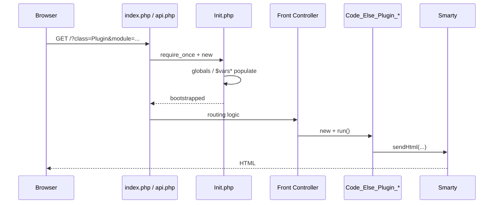

# Phase 1.1.c: 旧ルーティング・クラス命名規則整理

> 調査者: Explore サブエージェント
> 対象: `C:\Users\yusuk\StudioProjects\accounting\`
> 目的: 新 REST API 設計時に旧 URL パターンとクラス命名の網羅的理解を得る

---

## 1. エントリポイント別解析

### 1.1 `index.php`（Web UI）
- **役割**: 認証済みユーザを Plugin または Core Base モジュールへ、未認証はログイン画面へディスパッチ
- **flagRequest**: `'post'`（既定、フォーム送信）
- **ルーティング**:
  - `?class=Plugin&module=xxx` → `Code_Else_Plugin_{Module}_{Module}` を new
  - それ以外（`$varsAccount` あり） → `Code_Else_Core_Base_Base` を new
  - `$varsAccount` なし → `Code_Else_Core_Login_Login` を new
- **共通**: `$classCall->run()` でメソッド呼出

### 1.2 `api.php`（JSON API）
- **役割**: index.php と同じルーティングだが、JSON レスポンス専用
- **flagRequest**: `'json'`
- **flagAPI**: `1`（Init に渡される）
- **違い**: 認証失敗時にログイン画面へのリダイレクトなし（JSON エラー返却）

### 1.3 `output.php`（ファイル / PDF 出力）
- **役割**: ファイルダウンロード・生成（フォーム送信ヘッダなし）
- **flagRequest**: `'get'`
- **用途**: CSV/PDF エクスポート、レポート出力

### 1.4 `confirm.php`（確認画面）
- **役割**: 確認ステップ専用のエントリポイント
- **flagRequest**: `'or'`（POST または GET）
- **ルーティング**: `?type=xxx` → `Code_Else_Core_Confirm_{Type}` を new

---

## 2. クラス命名規則

### 基本パターン
```
Code_Else_{Tier}_{Domain}_{Module}[_{Submodule}]
```

| 要素 | 値 |
|---|---|
| Tier | `Plugin`, `Core`, `Lib`, `Config` |
| Domain | `Else`（システム名称） |
| Module | `Base`, `Login`, `Confirm`, `Accounting`, `Html`, `Db`, etc. |

### 例
| URL/文脈 | クラス名 | ファイル |
|---|---|---|
| Login 画面 | `Code_Else_Core_Login_Login` | `back/class/else/core/login/Login.php` |
| Core Base Root | `Code_Else_Core_Base_Root` | `back/class/else/core/base/Root.php` |
| 日本語会計銀行 | `Code_Else_Plugin_Accounting_Jpn_Banks` | `back/class/else/plugin/accounting/jpn/Banks.php` |
| HTML テーブル lib | `Code_Else_Lib_Html_Table` | `back/class/else/lib/Html/Table.php` |

---

## 3. モジュールディレクトリ一覧

### Core（`back/class/else/core/`）
| サブディレクトリ | クラス数 | 役割 |
|---|---|---|
| `base/` | 35 | ルーティング、モジュール、認証基盤 |
| `login/` | 6 | ポータル、セッション管理 |
| `confirm/` | 8 | 操作後の確認処理 |

### Plugin（`back/class/else/plugin/`）
| サブディレクトリ | クラス数 | 役割 |
|---|---|---|
| `accounting/` | 約 368 | 会計機能全般（`jpn/`, `jpn/2012/`, `jpn/api/` 等含む） |

### Lib（`back/class/else/lib/`）
16 ユーティリティ / ヘルパークラス:
`Db`, `Check`, `Display`, `Escape`, `File`, `Html`, `Mail`, `Media`, `Request`, `Crypte`, `Rebuild`, `Time`, `Smarty`（死蔵）

---

## 4. クラスプレフィックス別集計

| プレフィックス | 件数 |
|---|---|
| `Code_Else_Plugin_Accounting` | 368 |
| `Code_Else_Core_Base` | 35 |
| `Code_Else_Core_Confirm` | 8 |
| `Code_Else_Core_Login` | 6 |
| `Code_Else_Lib_*` | 16（ユーティリティ、各 1） |

---

## 5. リクエスト → クラス → テンプレートフロー

```
1. HTTP request (e.g., /index.php?class=Plugin&module=accounting&page=log)
     │
     ▼
2. Init.php bootstrap
   - PATH_* 定数 23 個設定
   - global classes (Smarty, Db, Request, ...) を初期化
   - $varsMedia / $varsRequest / $varsAccount を populate
     │
     ▼
3. クエリパラメタ抽出
   - ?class=, ?module=, ?ext=, ?type= を ucwords() 変換
     │
     ▼
4. ファイルパス構築
   - PATH_BACK_CLASS_ELSE_{TIER}/{module}/{Module}.php
   - file_exists() + preg_match() で blacklist チェック
     │
     ▼
5. require_once & new
   - new Code_Else_{Tier}_Else_{Module}()
     │
     ▼
6. $classCall->run() を呼出
     │
     ▼
7. Smarty テンプレート描画
   - $this->sendHtml(['path' => 'else/core/base/html/index.html', 'vars' => [...]])
   - テンプレート検索: back/tpl/templates/else/{tier}/{domain}/{filename}
     │
     ▼
8. HTTP response (HTML / JSON / ファイル)
```

### Mermaid 版



---

## 6. 新ルータへの Gotcha

1. **グローバル変数ブートストラップ**: Init.php が `$varsRequest`, `$varsAccount`, `$varsMedia`, `$varsModule`, `$varsPreference`, `$varsApiAccounts`, `$varsTerm` を populate。新 DI コンテナはこれらを同等に提供する必要あり。
2. **URL → クラスのケース**: `ucwords()` 依存（`?module=accounting` → `Accounting`）。case-insensitive でないと既存 URL が壊れる。
3. **パストークン化**: テンプレートパスに `<strLang>` / `<strPlugin>` プレースホルダがあり、ランタイムで置換される（例: `back/tpl/vars/else/plugin/accounting/<strLang>/...`）。
4. **ファイル存在検証**: `file_exists($path)` + ブラックリスト `!preg_match(...)`（`Init`, `Access`, `ModuleAbstract` 等を除外）。新ルータも同等の安全策が必要。
5. **Device チェック**: すべてのエントリポイントで `if ($varsMedia['device'] == 'else')` → レガシー multi-device。
6. **遅延ロード**: 必要時のみ `require_once`、autoloader なし。
7. **APC キャッシュ**: グローバルクラス（Smarty, Check, Time, File, Escape）をオプショナルにキャッシュ。新ルータでも同等戦略を検討。
8. **ミドルウェア不在**: 認可チェックは各 `run()` 内で `$classCheck->checkModule()` を手動呼出。新ルータはミドルウェア化が望ましい。
9. **`flagRequest` 多態**: `post` / `json` / `get` / `or` の 4 種で入力パース方法が変わる。新ルータでも対応必要。

---

## 7. 推奨ルーティング戦略（新アプリ向け）

### 方針: ファサードルータ + 段階移行

**ステップ**:

1. **デバイス検証**: 既存 `Media` クラス相当で `$varsMedia['device']` を populate
2. **セッション/アカウント状態の早期ロード**: `Access` 相当を前段で呼ぶ
3. **ディスパッチャ**: `Container::dispatch($type, $module, $ext)` で `?class=`, `?module=`, `?ext=` 階層を模倣
4. **依存注入**: グローバル `$vars*` ではなくコンストラクタ注入
5. **Smarty テンプレートパス規約**: 既存の `back/tpl/templates/else/{tier}/{domain}/...` を維持
6. **クラスファクトリ**: `new` を一元化し、file_exists 検証とブラックリストを適用
7. **後方互換**: 既存 URL `?class=Plugin&module=accounting&page=log` は新ルータの互換ハンドラで受け、内部で新コントローラに移譲

### 新 REST API ルート（Phase 3 で設計）

新 `/api/v1/*` ルートは完全に独立したモダンルータ（`nikic/fast-route` 想定）で実装し、旧 `?class=...` とは切り離す。旧ルートは Strangler Fig で徐々に退役。

---

## 8. Summary

- **4 エントリポイント**: index / api / output / confirm、全て Init.php 経由でグローバル bootstrap
- **クラス命名**: `Code_Else_{Tier}_{Domain}_{Module}` の 4 セグメント規約
- **総クラス数**: 約 450 クラス（Plugin/Accounting が 368 を占める）
- **主な Gotcha**: グローバル変数依存、autoloader 不在、ミドルウェア不在、flagRequest 多態
- **新ルータ方針**: 新 `/api/v1/*` は独立モダンルータ、旧 URL は互換ハンドラで受けて徐々に退役（Strangler Fig）
